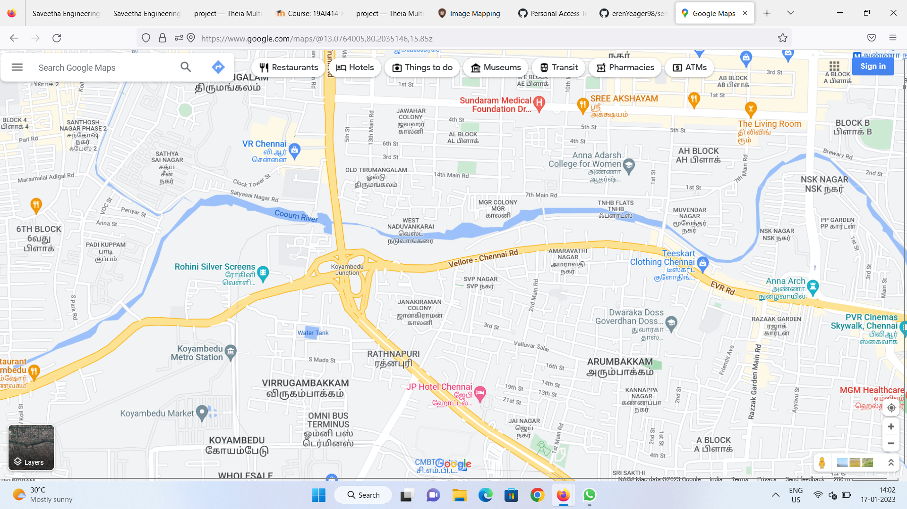
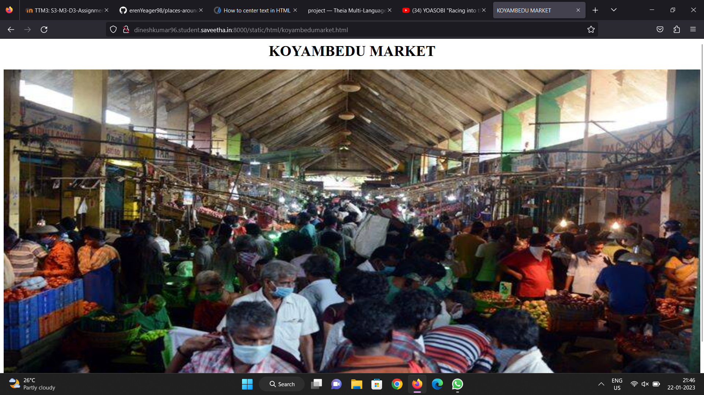
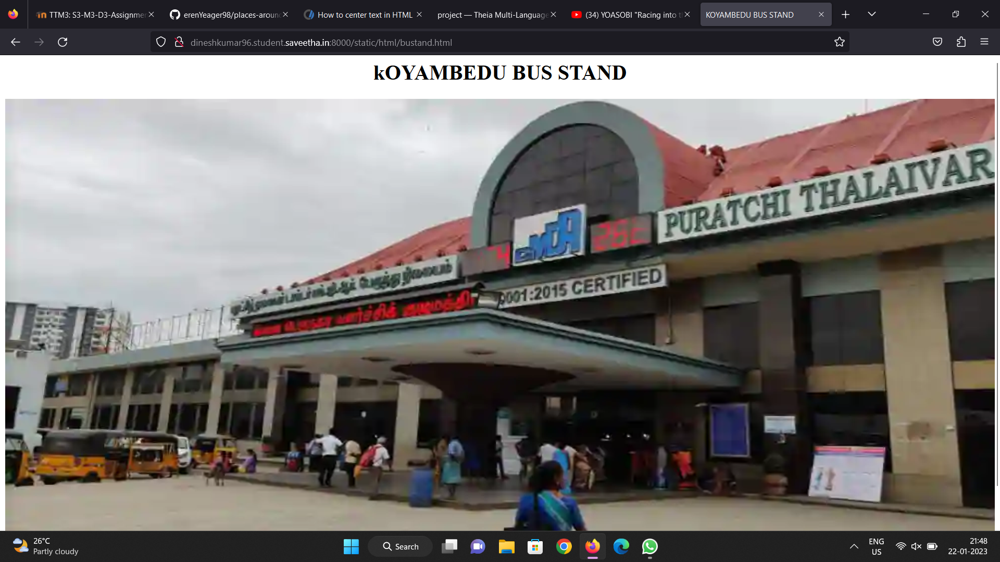
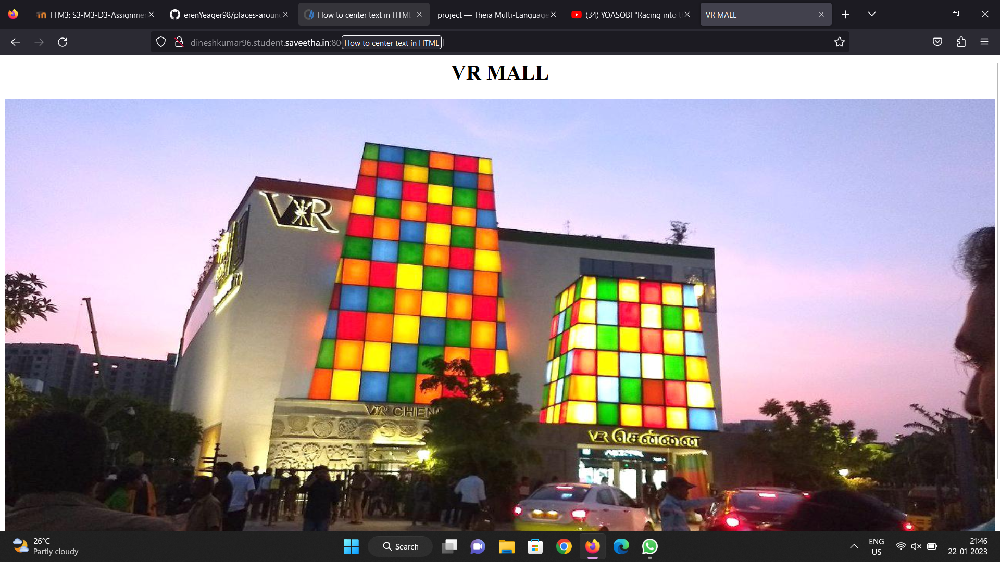
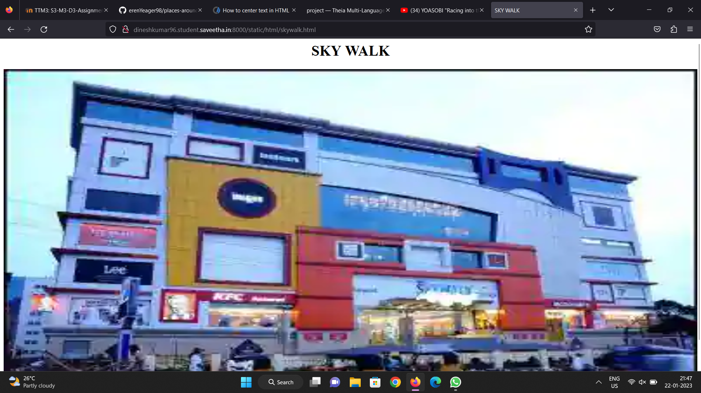
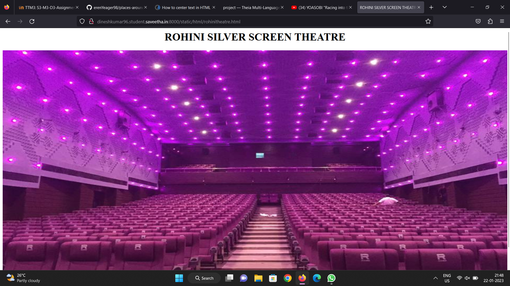

# Places Around Me
## AIM:
To develop a website to display details about the places around my house.

## Design Steps:

### Step 1:
Open up a terminal in your preffered location, and start a django project using djang-admin startproject <your-project-name> Next setup an app inside the project folder using django-admin startapp <your-app-name>
### Step 2:
Once Created ,link your app to the project by adding it in the list of apps in settings.py file located inside the project folder. Add access to your host in allowed host setting and add static folders path to your settings.py file.
### Step 3:
Create a static folder and template folder and add all your required files for the project - Images .etc in your static folder. In the Template folder add your html files required for the pages.
### Step 4:
Head to the views.py in your app folder and create required functions to render a particular page or template when requested by the client. Next go to the urls.py and route the correct view functions to each particular request as needed.
### Step 5:
Next start the server from the projects main directory using python3 manage.py runserver 0:<portnumber>. Now the pages can be accessed from all the routed addresses in urls.py .

## Code:
File: index.html
```
<html>
    <head>
        <title>PLACES AROUND ME</title>
        </head>
<body>
    <h1><center>PLACES AROUND ME</center></h1>    
    

<map name="image-map">
    <area target="_parent" alt="" title="" href="koyambedumarket.html" coords="719,894,419,711" shape="rect">
    <area target="_parent" alt="" title="" href="vrmall.html" coords="843,541,551,378" shape="rect">
    <area target="_parent" alt="" title="" href="skywalk.html" coords="1550,752,1285,607" shape="rect">
    <area target="_parent" alt="" title="" href="bustand.html" coords="1150,941,897,808" shape="rect">
    <area target="_parent" alt="" title="" href="rohinitheatre.html" coords="490,551,768,675" shape="rect">
</map>
</body>
</html>
```    
File: bustand.html
```
   <html>
<head>
<title>
KOYAMBEDU BUS STAND
</title>
</head>
<body>
     <h1><center>kOYAMBEDU BUS STAND</center></h1>
    
</body>
</html>
```
File: market.html
```
    <html>
<head>
<title>
KOYAMBEDU MARKET
</title>
</head>
<body>
     <h1><center>KOYAMBEDU MARKET</center></h1>
    
</body>
</html>
```
File: rohinitheatre.html
```
   <html>
<head>
<title>
ROHINI SILVER SCREEN THEATRE
</title>
</head>
<body>
     <h1><center>ROHINI SILVER SCREEN THEATRE</center></h1>
    
</body>
</html>
```
File: skywalk.html
```
    <html>
<head>
<title>
SKY WALK
</title>
</head>
<body>
     <h1><center>SKY WALK</center></h1>
    
</body>
</html>
```
File: vrmall.html
```
    <html>
<head>
<title>
VR MALL</title>
</head>
<body>
    <h1><center>VR MALL</center><h1>
    
</body>
</html>
```
    
## Output:

    



    
## Result:
Write your result
